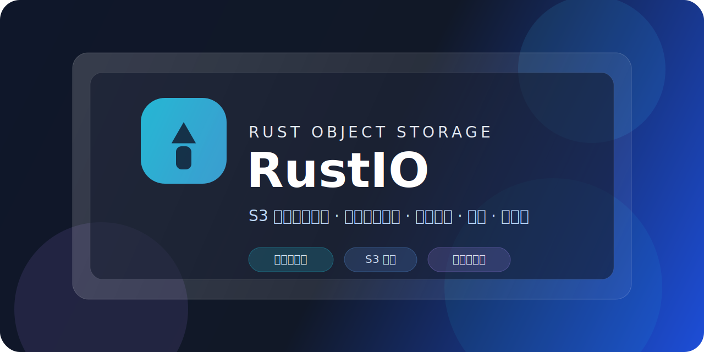

<p align="center">
  
</p>

<h1 align="center">RustIO</h1>

<p align="center">
  基于 Rust 的 S3 兼容对象存储服务，内置单端口管理控制台，支持集群管理、复制与纠删码。
</p>

<p align="center">
  
  
  
  
  
</p>

## 项目简介

RustIO 是一个基于 Rust 的对象存储服务，提供：

- S3 兼容接口
- 管理控制台
- 集群管理与健康检查
- IAM / 审计 / 指标摘要
- 复制、生命周期、对象锁与 KMS 能力
- 纠删码、读写 quorum 与数据保护能力

对外部署建议优先使用下面两种方式之一：

- **Docker 部署**：最简单，适合大多数用户
- **源码部署**：适合需要本地构建或二次开发的用户

## 默认端口

- S3 / Admin API：`9000`
- Web Console：`9000`

## 默认账号

### 管理控制台

- 用户名：`admin`
- 密码：`rustio-admin`

可通过环境变量覆盖：

- `RUSTIO_CONSOLE_USER`
- `RUSTIO_CONSOLE_PASSWORD`

### S3 Root 账号

默认会读取以下环境变量：

- `RUSTIO_ROOT_USER`
- `RUSTIO_ROOT_PASSWORD`

如果未设置，将使用程序内默认值。

## 方式一：Docker 部署

### 前置要求

- 已安装 Docker
- 已安装 Docker Compose 插件

### 启动

在项目根目录执行：

```bash
./start.sh
```

代码有更新、需要强制重建镜像时：

```bash
./start.sh --build
```

如果你直接用 Docker Compose 命令，默认启动可执行：

```bash
docker compose up -d
```

需要强制重建镜像时再执行：

```bash
docker compose up --build -d
```

### 访问地址

- 控制台：`http://你的服务器IP:9000`
- S3 / Admin API：`http://你的服务器IP:9000`

### 数据持久化

Docker 模式下，数据会持久化到项目根目录的：

```bash
./data
```

### 停止

```bash
docker compose down
```

### 启动说明

- 首次启动会自动构建镜像，时间会稍长。
- 后续默认可复用已有镜像直接启动，不必每次强制重建。
- 只有在代码更新、依赖变化或 Dockerfile 变更时，才建议使用 `./start.sh --build`。

## 方式二：源码部署

### 前置要求

- Rust 工具链
- Node.js 22+（用于构建控制台前端）

macOS / Linux 可直接执行：

```bash
# 安装 Rust
curl --proto '=https' --tlsv1.2 -sSf https://sh.rustup.rs | sh -s -- -y
source "$HOME/.cargo/env"

# 安装 Node.js 22+
curl -o- https://raw.githubusercontent.com/nvm-sh/nvm/v0.40.3/install.sh | bash
export NVM_DIR="$HOME/.nvm"
[ -s "$NVM_DIR/nvm.sh" ] && . "$NVM_DIR/nvm.sh"
nvm install 22
nvm alias default 22

# 验证版本
rustc -V
cargo -V
node -v
npm -v
```

### 一键启动

```bash
chmod +x ./start-source.sh
./start-source.sh
```

脚本会自动完成以下步骤：

- 检查并安装 Rust（缺失时自动通过 `rustup` 安装）
- 检查并安装 Node.js 22+（缺失或版本过低时自动通过 `nvm` 安装）
- 构建控制台前端
- 构建后端
- 创建 `./data` 数据目录
- 以源码模式启动 RustIO
- 若检测到可用镜像，会自动优先使用 Rust / Node / npm 加速源

### 等价手动命令

```bash
export RUSTUP_DIST_SERVER=https://rsproxy.cn
export RUSTUP_UPDATE_ROOT=https://rsproxy.cn/rustup
export NVM_NODEJS_ORG_MIRROR=https://npmmirror.com/mirrors/node
export CARGO_REGISTRIES_CRATES_IO_PROTOCOL=sparse

npm ci --prefix web/console
npm run build --prefix web/console
cargo build --release -p rustio
mkdir -p ./data

RUSTIO_ADDR=0.0.0.0:9000 \
RUSTIO_DATA_DIR=./data \
RUSTIO_CONSOLE_DIST=$PWD/web/console/dist \
./target/release/rustio
```

如果卡在：

```text
info: downloading installer
warn: Not enforcing strong cipher suites for TLS, this is potentially less secure
```

通常不是脚本死锁，而是 `rustup` 正在访问默认下载源但网络很慢。可先手动执行：

```bash
export RUSTUP_DIST_SERVER=https://rsproxy.cn
export RUSTUP_UPDATE_ROOT=https://rsproxy.cn/rustup
./start-source.sh
```

若你明确不想使用镜像，可执行：

```bash
RUSTIO_AUTO_MIRROR=0 ./start-source.sh
```

如果服务器没有 Docker，且系统太旧导致 Node.js 22 无法运行，可在另一台新机器先构建前端，再把 `web/console/dist` 同步到服务器，然后执行：

```bash
RUSTIO_SKIP_WEB_BUILD=1 ./start-source.sh
```

这种方式下，服务器只负责：

- 使用现有 `web/console/dist`
- 本地编译 Rust 后端
- 启动单端口服务

### 访问地址

- 控制台：`http://你的服务器IP:9000`
- S3 / Admin API：`http://你的服务器IP:9000`

源码部署是**单端口模式**，控制台与 S3 / Admin API 共用 `9000` 端口。

## 常用环境变量

### 服务监听与数据目录

- `RUSTIO_ADDR`：监听地址，示例 `0.0.0.0:9000`
- `RUSTIO_DATA_DIR`：数据目录，示例 `./data`
- `RUSTIO_CONSOLE_DIST`：前端静态资源目录，源码部署时需要指定为 `web/console/dist`

### 控制台账号

- `RUSTIO_CONSOLE_USER`
- `RUSTIO_CONSOLE_PASSWORD`

### S3 Root 账号

- `RUSTIO_ROOT_USER`
- `RUSTIO_ROOT_PASSWORD`

## 服务器部署建议

- 放通 `9000` 端口
- 生产环境建议在前面加 Nginx / Caddy / Traefik 反向代理
- 生产环境建议修改默认控制台账号与 S3 Root 账号

## 健康检查

服务启动后可检查：

- `GET /health/live`
- `GET /health/ready`
- `GET /health/cluster`

例如：

```bash
curl http://127.0.0.1:9000/health/live
```

## 常见问题

### 1. 局域网能打开页面但无法登录

请优先确认：

- 你访问的是服务器 IP，不是 `127.0.0.1`
- 服务器的 `9000` 端口已放行
- Docker 模式下 `rustio` 容器已经启动成功

### 2. Docker 重启后数据丢失

请确认项目根目录下存在：

```bash
./data
```

并且 `docker-compose.yml` 中的卷挂载没有被改掉。

### 3. 源码部署后看不到控制台

请确认已经执行：

```bash
npm run build --prefix web/console
```

并在启动时设置了：

```bash
RUSTIO_CONSOLE_DIST=$PWD/web/console/dist
```

## 仓库结构

- `crates/`：Rust 后端源码
- `web/console/`：Web 管理控制台源码
- `Dockerfile.rustio`：后端镜像构建文件
- `docker-compose.yml`：Docker 部署入口
- `start.sh`：一键启动脚本

如果你只是部署使用，可以只关注：

- `README.md`
- `docker-compose.yml`
- `start.sh`
