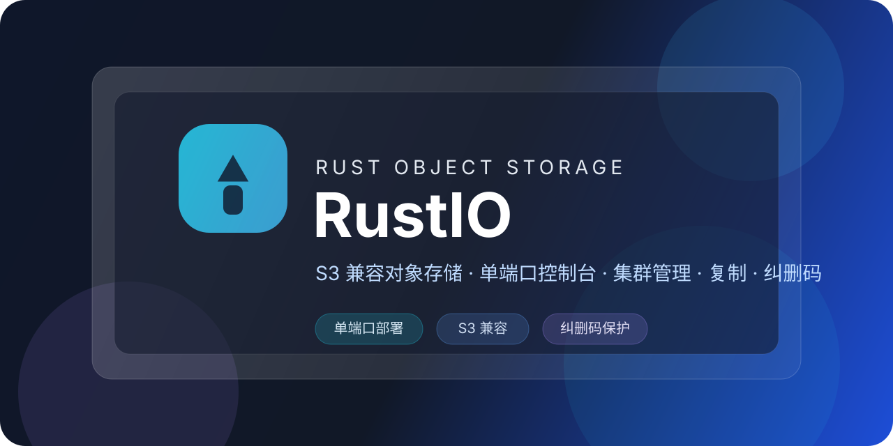

<p align="center">
  
</p>

<h1 align="center">RustIO</h1>

<p align="center">
  基于 Rust 的 S3 兼容对象存储服务，内置单端口管理控制台，支持集群管理、复制与纠删码。
</p>

<p align="center">
  
  
  
  
  
</p>

RustIO 提供 S3 兼容对象接口、单端口管理控制台、集群管理与健康检查、IAM / 审计 / 指标摘要、复制 / 生命周期 / 对象锁 / KMS，以及纠删码与读写 quorum 数据保护。

## 快速开始

**方式一 · 一键部署脚本（推荐，服务器直接跑，自动装 systemd 服务）**

```bash
curl -sSL https://raw.githubusercontent.com/achunchunya/RustIO/main/scripts/install.sh | bash

# 国内网络可加镜像加速
curl -sSL https://raw.githubusercontent.com/achunchunya/RustIO/main/scripts/install.sh | RUSTIO_GH_MIRROR=https://ghproxy.com/ bash
```

**方式二 · Docker**

```bash
./scripts/start.sh          # 前台启动
./scripts/start.sh -d        # 后台启动
./scripts/start.sh --build   # 强制重建镜像
./scripts/start.sh --down    # 停止
```

**方式三 · 源码构建**（缺 Rust/Node 时脚本自动安装）

```bash
chmod +x ./scripts/start-source.sh
./scripts/start-source.sh
```

三种方式启动后都通过 `http://<服务器IP>:9000` 访问控制台与 S3 / Admin API（单端口模式）。

## 部署后运维

安装完成后，**`rustio-deploy` 工具已自动留存到服务器**（路径 `/usr/local/bin/rustio-deploy`），下面所有操作都可用它，不用重新下载脚本。

```bash
# 升级
rustio-deploy upgrade
curl -sSL https://raw.githubusercontent.com/achunchunya/RustIO/main/scripts/install.sh | bash -s -- upgrade   # 或在线升级

# 卸载
rustio-deploy uninstall
rustio-deploy uninstall --purge     # 连同数据一起删(不可恢复)

# 交互菜单(安装/升级/卸载/集群/接管 systemd 等)
rustio-deploy
./scripts/install.sh                                                         # 本地 clone 了仓库的话
bash <(curl -sSL https://raw.githubusercontent.com/achunchunya/RustIO/main/scripts/install.sh)  # 在线交互

# 把正在跑的 nohup/手动进程接管为 systemd 服务
rustio-deploy systemd

# 本地多节点测试集群(含自动升级与停止)
rustio-deploy cluster --nodes 3 --base-port 19801
rustio-deploy cluster --down --data ~/.rustio/cluster
rustio-deploy upgrade --nodes <集群数据>/nodes.conf --dry-run   # 验证滚动升级

# 把已部署的单机实例扩容为集群
rustio-deploy expand --peer 2=http://<新机器IP>:9000
```

## 核心亮点

| 维度 | 能力 |
| --- | --- |
| **LIST 元数据索引** | 25× 更快——redb 有序 KV 索引,单页延迟与桶规模解耦(O(log n+page)) |
| **在线弹性扩缩** | 零停机——运行时增删节点 + 存量数据再平衡 |
| **Raft 强一致 HA** | 控制面多节点共识 + 优雅 Leader 转移 + 动态成员 |
| **EC + SIMD 高吞吐** | NEON / AVX 加速 5.7× 编码,单机 GET 吞吐超 MinIO 集群 2× |
| **分层混合一致性** | 数据→quorum / 元数据→redb 索引 / 控制面→raft(业界独有架构) |
| **全开源 Admin** | IAM / OIDC / LDAP / KMS / 治理 / 控制台 全开源,无商业锁定 |
| **安全加固** | 恒定时间比较 / 安全响应头 / 账户 lockout / 注入防护 |
| **S3 全兼容** | 15+ 子资源全覆盖,MinIO 健康检查别名兼容 |

> 基准数字来源:[scripts/list-bench](./scripts/list-bench/)、[scripts/throughput-bench](./scripts/throughput-bench/)、EC criterion bench;同类产品对照为公开数字。

## 默认账号

| 用途 | 用户名 / Access Key | 密码 / Secret Key | 覆盖用环境变量 |
| --- | --- | --- | --- |
| 管理控制台 | `admin` | `rustio-admin` | `RUSTIO_CONSOLE_USER` / `RUSTIO_CONSOLE_PASSWORD` |
| S3 Root | `rustioadmin` | `rustioadmin` | `RUSTIO_ROOT_USER` / `RUSTIO_ROOT_PASSWORD`(兼容 `MINIO_ROOT_USER/PASSWORD`) |

⚠️ 生产环境务必修改以上默认账号，登录后也可在控制台「修改密码」自助更改。

## 常用环境变量

| 变量 | 作用 | 默认值 |
| --- | --- | --- |
| `RUSTIO_ADDR` | 监听地址 | `0.0.0.0:9000` |
| `RUSTIO_DATA_DIR` | 数据目录 | `./data` |
| `RUSTIO_CONSOLE_DIST` | 前端静态资源目录(源码启动) | `./web/console/dist` |
| `RUSTIO_JWT_SECRET` | JWT 签名密钥(生产必须显式设置) | 随机生成 |
| `RUSTIO_HOST_PORT` / `RUSTIO_DATA_DIR_HOST` | Docker 宿主机端口/数据目录 | `9000` / `./data` |
| `RUSTIO_SKIP_WEB_BUILD` / `RUSTIO_FORCE_WEB_BUILD` | 源码启动跳过/强制重建前端 | `0` |
| `RUSTIO_ALLOW_INSECURE` | 跳过启动安全校验(仅本地开发) | 未设置 |

完整的 100+ 项环境变量（集群 / Raft、复制、存储治理、告警通道、OIDC / LDAP、KMS、内存维护等高级配置及默认值）见 **[`rustio.env.example`](./rustio.env.example)**——按功能分类、逐项注释，可直接复制到 `/etc/rustio/env` 按需取用。

## 健康检查

```bash
curl http://127.0.0.1:9000/health/live
curl http://127.0.0.1:9000/health/ready
curl http://127.0.0.1:9000/health/cluster
```

## 生产部署建议

- 放通对外访问端口(默认 `9000`)，修改默认控制台账号与 S3 Root 账号
- 数据目录挂载到独立磁盘；显式设置 `RUSTIO_JWT_SECRET`
- 需要 TLS / 域名 / 统一入口时，前置 Nginx / Caddy / Traefik
- 手动启动的实例建议接管为 systemd 服务，便于升级时自动重启：
  ```bash
  curl -sSL https://raw.githubusercontent.com/achunchunya/RustIO/main/scripts/install.sh | bash -s -- systemd
  ```
- 需要多节点集群时：本地测试用 `rustio-deploy cluster`；把已部署的单机扩容为集群用 `rustio-deploy expand --peer <node_id>=<host:port>`

## 常见问题

- **Docker 提示 API 版本过高**：`./scripts/start.sh` 已自动兼容，重跑一次即可；手动执行 Compose 需先 `export DOCKER_API_VERSION=1.43`。
- **老系统跑不了 Node.js 22**：`./scripts/start-source.sh` 会自动回退到 Docker 构建前端；两者都没有时，换台机器构建好 `web/console/dist` 后同步过来，再 `./scripts/start-source.sh --skip-web-build`。
- **页面能打开但登录不了**：确认访问的是服务器真实 IP/域名而非 `127.0.0.1`、对外端口已放行、控制台账号是否被环境变量覆盖过。
- **Docker 重启后数据丢失**：检查宿主机数据目录是否被清理、`docker-compose.yml` 的数据卷挂载是否被改动。
- **怎么卸载**：`rustio-deploy uninstall`（保留数据目录），或 `rustio-deploy uninstall --purge`（连同数据一起删，不可恢复）。如果 `rustio-deploy` 找不到了，用在线命令：`curl -sSL https://raw.githubusercontent.com/achunchunya/RustIO/main/scripts/install.sh | bash -s -- uninstall`。

## 仓库结构

- `crates/`：Rust 后端源码
- `web/console/`：Web 管理控制台源码
- `scripts/install.sh`：部署管理统一入口（安装/升级/卸载/systemd 接管/本地集群/单机扩容为集群，见 `--help`）
- `rustio.env.example`：完整环境变量参考
- `docker-compose.yml` / `scripts/start.sh` / `scripts/start-source.sh`：三种启动方式入口

## 贡献说明

提交 Issue / PR 前请自检：说明改动目的与验证方式、文档与代码同步、不含敏感信息、涉及部署链路时优先验证 `./scripts/start.sh` 或 `./scripts/start-source.sh`。
